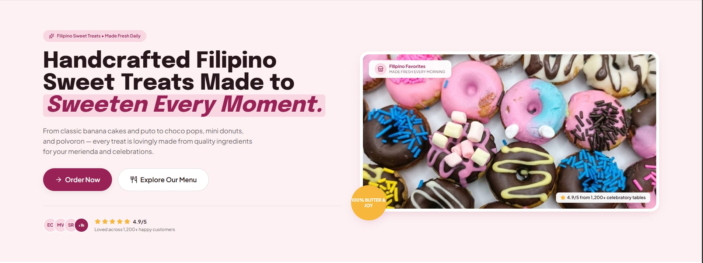
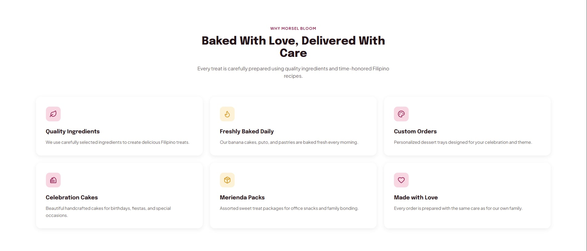
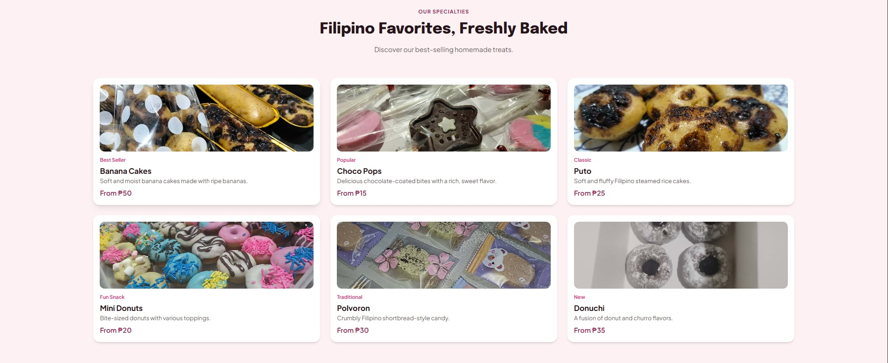
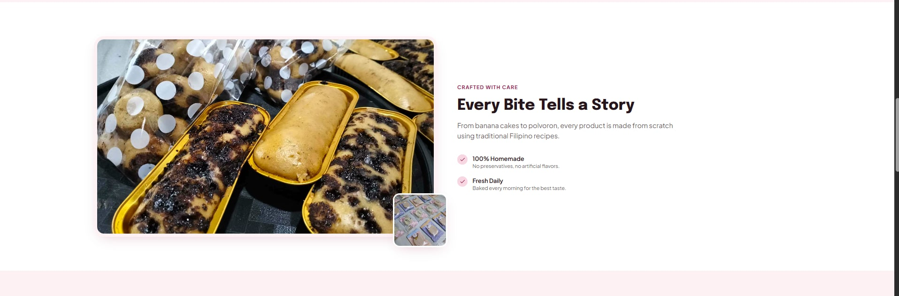
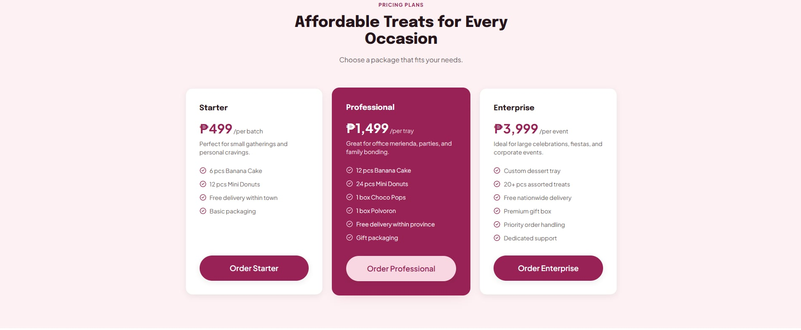
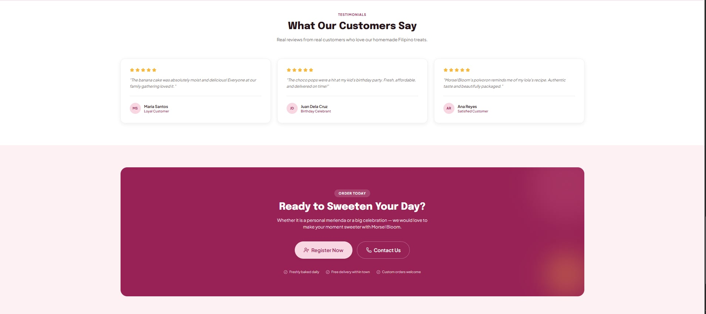
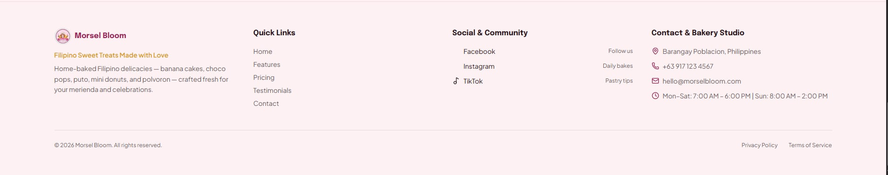
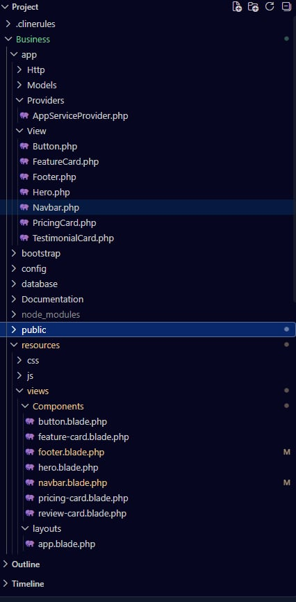
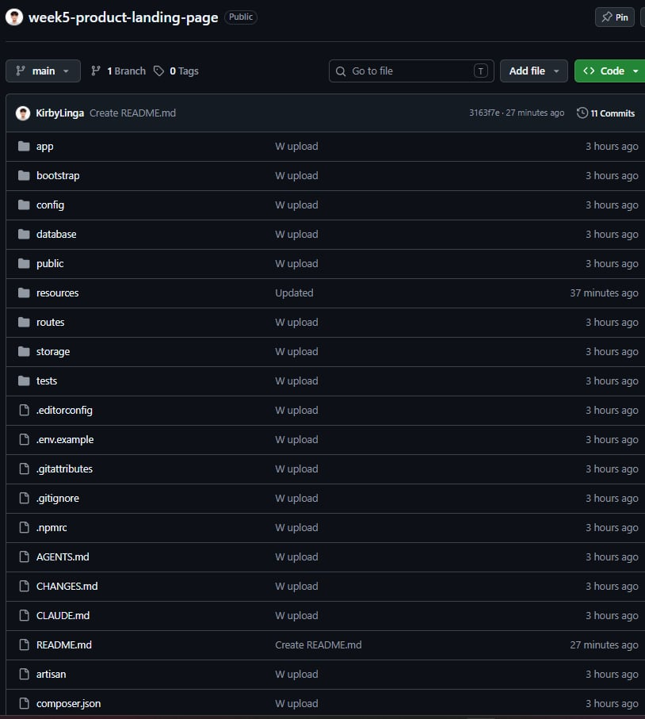

# Morsel Bloom — Responsive Product Landing Page

**ITST 302 – Client-Server Technologies | Week 5 | Mini Project 04**

---

## 1. Introduction

### What is a Product Landing Page?
A product landing page is a standalone web page designed with a single focus: introducing a product or business to visitors and guiding them toward a specific action, such as placing an order, sending an inquiry, or following the brand online. Unlike a general website with many pages and navigation paths, a landing page is intentionally focused, presenting only the information a customer needs to understand what is being offered and why it matters.

### Why Landing Pages Are Important for Businesses
For small and local businesses like Morsel Bloom, a landing page is often the first digital impression a potential customer has of the brand. A clear, professional landing page:
- Builds trust and credibility for a home-based or small business.
- Presents products, pricing, and contact details in one convenient place.
- Improves customer engagement and encourages orders or inquiries.
- Extends the brand's reach beyond word-of-mouth and social media posts.

### Purpose of the Project
This project transforms Morsel Bloom's existing product line and brand identity into a clean, responsive, and professional landing page. The goal is to give the business a digital presence that reflects the quality of its products while demonstrating component-based frontend development using Laravel Blade and Tailwind CSS.

---

## 2. Objectives

Through this activity, the following learning objectives were accomplished:

- Developed a fully responsive web interface using Tailwind CSS utility classes.
- Built reusable Laravel Blade Components to eliminate duplicated markup across the page.
- Applied responsive design principles across desktop, tablet, and mobile breakpoints.
- Organized frontend code following Laravel's recommended folder structure (layouts, components, pages).
- Implemented consistent UI design through a unified color palette, typography, and spacing system.
- Documented the frontend architecture, component design, and design evolution of the project.
- Prepared the project for professional portfolio publication via GitHub and LinkedIn.

---

## 3. Responsive Web Design

### Mobile-First Design
The layout was built starting from the smallest screen size and progressively enhanced for larger viewports. Base utility classes in Tailwind target mobile screens by default, with sm:, md:, and lg: prefixes layered on top to adjust layout, spacing, and typography as the viewport grows.

### Responsive Breakpoints
Tailwind's default breakpoints were used to adapt the layout:
- Mobile (< 640px) + single-column stacked layout.
- Tablet (md: >= 768px) + two-column grids for features and products.
- Desktop/Laptop (lg: >= 1024px) + three-column grids, expanded navigation, and larger hero imagery.

### Flexbox
Flexbox (flex, items-center, justify-between) was used for one-dimensional layouts such as the navigation bar and the footer's link columns.

### CSS Grid
CSS Grid (grid, grid-cols-*) was used for two-dimensional layouts such as the product/feature cards and pricing cards.

### User Experience (UX)
Responsive design directly affects UX: a layout that adapts to any screen size keeps content readable, buttons tappable, and images properly scaled regardless of device.

### Why Responsive Design Matters
With the majority of web traffic coming from mobile devices, a non-responsive site risks losing customers due to poor readability, broken layouts, or difficult navigation.

---

## 4. Tailwind CSS

### Utility-First CSS
Tailwind CSS provides small, single-purpose utility classes that are combined directly in markup, rather than writing separate custom CSS files for each component.

### Advantages
- Faster styling directly in Blade templates without switching files.
- Consistent spacing and sizing scale across the entire project.
- Smaller final CSS bundle since only used utilities are compiled.
- Easy to maintain and adjust without hunting through stylesheets.

### Responsive Utility Classes
```html
<div class="grid grid-cols-1 sm:grid-cols-2 lg:grid-cols-3 gap-6">
```

### Component Styling
```html
<div class="bg-white rounded-2xl shadow-md hover:shadow-lg transition p-4">
    
    <span class="text-xs font-semibold text-pink-600">Tag</span>
    <h3 class="text-lg font-bold">Title</h3>
    <p class="text-sm text-gray-600">Description</p>
    <p class="mt-2 font-semibold">Price</p>
</div>
```

---

## 5. Blade Components

Blade Components are reusable pieces of Laravel's templating engine that encapsulate a section of markup into a single, reusable file. They can accept data through props and be inserted into any page using a simple tag.

### Components Used
```
resources/views/components/
+-- navbar.blade.php
+-- hero.blade.php
+-- feature-card.blade.php
+-- pricing-card.blade.php
+-- review-card.blade.php
+-- button.blade.php
+-- footer.blade.php
```

---

## 6. User Interface Design

---

## 7. Folder Structure

```
week05-product-landing-page/
+-- app/
+-- resources/views/
|   +-- layouts/        -> app.blade.php
|   +-- components/     -> All reusable Blade Components
|   +-- pages/          -> Landing page views
+-- public/             -> Static assets and product images
+-- screenshots/        -> Project screenshots
+-- README.md
```

---

## 8. Screenshots

| Section | Screenshot |
|---|---|
| Hero Section |  |
| Features Section |  |
| Features Grid |  |
| Features Cards |  |
| Pricing Section |  |
| Reviews |  |
| Footer |  |
| Blade Components |  |
| GitHub Repository |  |

---

## Reflection

Building the Morsel Bloom landing page reinforced how much cleaner and faster development becomes with reusable Blade Components and utility-first CSS.

---

## Author

Developed as part of **ITST 302 – Client-Server Technologies**, Week 5 Laboratory Activity (Mini Project 04).
